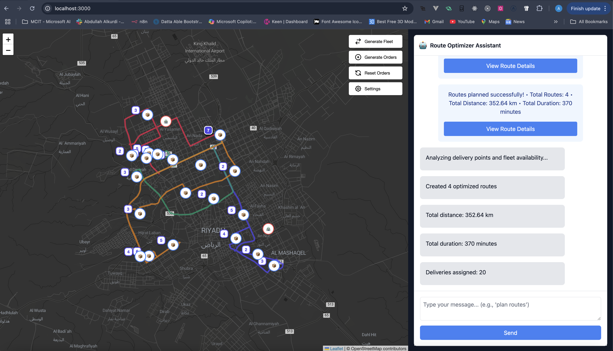

# AI-Powered Route Optimizer

An intelligent route optimization system powered by AI models through OpenRouter API, featuring multiple distribution centers, fleet management, and real-time route visualization.



## Features

- 🤖 AI-powered route optimization using multiple models (Claude, GPT-4, Mistral, DeepSeek)
- 🗺️ Real-time route visualization on interactive maps
- 📦 Multiple distribution centers support
- 🚚 Fleet management system
- ⏱️ Time window and priority-based delivery planning
- 💾 SQLite database for data persistence
- 🔄 Real-time updates and status tracking

## Prerequisites

- Node.js (v14 or higher)
- NPM (v6 or higher)
- OpenRouter API key
- Any modern web browser

## Installation

1. Clone the repository:
```bash
git clone https://github.com/yourusername/route-optimizer.git
cd route-optimizer
```

2. Install dependencies for both frontend and backend:
```bash
# Install backend dependencies
npm install

# Install frontend dependencies
cd frontend
npm install
cd ..
```

3. Create environment file:
```bash
# Create .env file in the backend folder
cp .env.example .env
```

4. Configure your environment variables in `.env`:
```bash
OPENROUTER_API_KEY=sk-or-v1-YOUR_API_KEY
PORT=3000
NODE_ENV=development
```

## Building the Application

1. Build the frontend:
```bash
cd frontend
npm run build
cd ..
```

2. The build files will be automatically served by the backend.

## Running the Application

1. Start the development server:
```bash
npm run dev
```

2. For production:
```bash
npm run build  # Builds the frontend
npm start      # Starts the production server
```

3. Access the application:
- Development: http://localhost:3000
- Production: Your deployed URL

## Configuration

### AI Models
You can configure different AI models for various tasks in the settings:
- Chat/Conversation
- Reasoning
- Route Optimization

Available models:
- Claude 3 (Haiku/Sonnet/Opus)
- GPT-4 Turbo
- Mistral 7B
- DeepSeek Coder

### Distribution Centers
Configure multiple distribution centers with:
- Location coordinates
- Capacity
- Operating hours

### Fleet Management
Manage your delivery fleet with:
- Vehicle types (Trucks/Vans)
- Capacity constraints
- Maintenance schedules

## API Documentation

### Main Endpoints
- `POST /api/optimize-route`: Create optimized delivery routes
- `POST /api/fleet`: Manage fleet vehicles
- `GET /api/settings`: Retrieve system settings
- `POST /api/settings`: Update system settings

## Development

### Project Structure
```
route-optimizer/
├── backend/
│   ├── server.js
│   ├── db/
│   └── routes/
├── frontend/
│   ├── src/
│   ├── public/
│   └── package.json
├── package.json
└── README.md
```

### Database Schema
The application uses SQLite with the following main tables:
- `fleet`: Vehicle management
- `outlets`: Distribution centers
- `orders`: Delivery orders
- `routes`: Optimized routes
- `ai_settings`: AI configuration

## Troubleshooting

Common issues and solutions:
1. **API Key Issues**: Ensure your OpenRouter API key is correctly set in .env
2. **Database Errors**: Check file permissions for SQLite database
3. **Build Errors**: Clear node_modules and reinstall dependencies

## Contributing

1. Fork the repository and clone it use it as you like.

## Acknowledgments

- OpenRouter API for AI model access
- OpenStreetMap for mapping data

```bash
npm install
npm run dev
```

add the following to the .env file in the backend folder:

```bash
OPENROUTER_API_KEY=sk-or-v1-YOUR_API_KEY
PORT=3000
NODE_ENV=development
```

